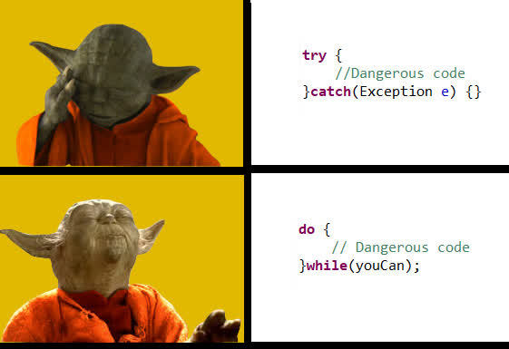

# Hello from Jatin Singhal! 👋

👋 This is my first repository with **hushh**.

🚀 **What I want to learn during this internship:**

- How to write production-ready code 🧑‍💻
- Deep dive into agentic flow and AI systems 🤖
- How to operate effectively in a tech startup environment 🚀

🎯 **One fun project idea I’d love to explore:**

I'd love to contribute to building a **single AI agent for students** that:

- Organizes all their classes and schedules 🗓️
- Compiles email summaries automatically ✉️
- Creates intelligent reminders 📌
- Plans for upcoming tests and exams 📚

This tool could help students manage their academic life more efficiently using AI-driven planning and automation.

---

🧘‍♂️ **My Coding Mantra:**

